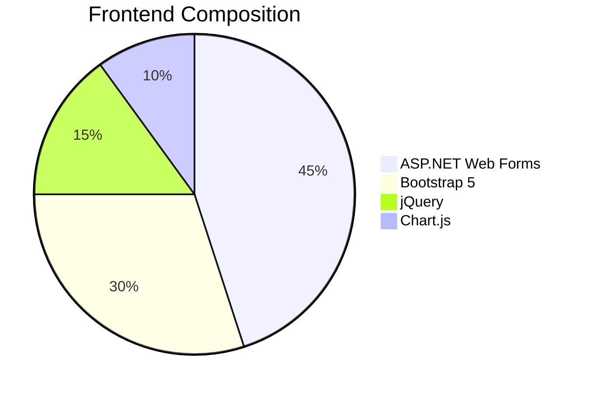
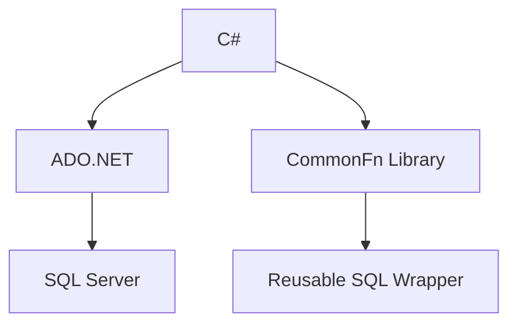
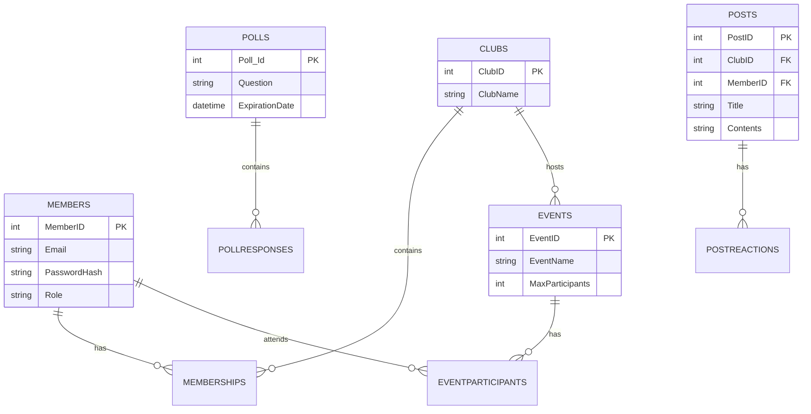

# 🏛️ ClubSphere - University Club Management Portal

<div align="center">
  
  
  
  
  
</div>


## 🚀 Key Features

### 🧑‍💼 Admin Module
```diff
+ 📊 Real-time Dashboard Analytics
- Total Members | Upcoming Events | Active Polls | Recent Posts
+ 🛠️ Full CRUD Operations (Clubs/Events/Members/Polls/Posts)
+ 📈 Automated Report Generation
+ 📧 SMTP Email Notifications (Gmail API)
```

### 👥 Member Module
```diff
+ 🔍 Club Discovery & Registration
+ 🗳 Interactive Poll Participation
+ 📅 Event Calendar Integration
+ 📝 Post/Comment System
```

### 🔐 Security System
```csharp
// SHA-256 Password Hashing
using System.Security.Cryptography;

public string HashPassword(string password) {
    byte[] bytes = SHA256.HashData(Encoding.UTF8.GetBytes(password));
    return BitConverter.ToString(bytes).Replace("-", "").ToLower();
}
```

### 📊 Data Visualization
| Component          | Technology     | Sample Query |
|--------------------|---------------|--------------|
| Member Growth Chart | Chart.js | `SELECT FORMAT(JoinDate,'MMM yyyy'), COUNT(*) FROM Members GROUP BY...` |
| Event Distribution | Bootstrap Cards | `SELECT ClubName, COUNT(*) FROM Events GROUP BY ClubName` |

## 🛠 Technology Stack

### Frontend


### Backend


## 🏗️ Project Structure
```bash
ClubSphere/
├── Admin/
│   ├── AdminHome.aspx        # Analytics Dashboard
│   ├── ViewMembers.aspx      # Member Management
│   └── GenerateReport.aspx   # PDF Report Generator
├── Member/
│   ├── MemberHome.aspx       # User Dashboard
│   └── JoinClub.aspx         # Club Registration
├── Models/
│   ├── EmailService.cs       # SMTP Client
│   └── CommonFn.cs           # Database Helper
└── Web.config                # App Configuration
```

## 🚀 Getting Started

### Prerequisites
- Visual Studio 2019+
- SQL Server Express
- .NET Framework 4.7.2

### Installation
```bash
git clone https://github.com/RexMaina/ClubSphere.git
cd ClubSphere
```

### Database Setup
1. Execute SQL script:
```sql
CREATE DATABASE CommunicationPortal_DB;
-- Run schema.sql and seed.sql
```

2. Configure connection:
```xml
<!-- Web.config -->
<connectionStrings>
  <add name="clubCS" 
       connectionString="Server=localhost\SQLEXPRESS;Database=CommunicationPortal_DB;Integrated Security=True;"
       providerName="System.Data.SqlClient"/>
</connectionStrings>
```
3. Database Schema (ER Diagram)




## 📦 Full Project Summary

> ClubSphere is a dynamic club engagement web portal that empowers universities to manage events, clubs, polls, and posts.

### 🧠 Modules
- ✅ Authentication (Login/Signup) with session & SHA256 password security
- ✅ Club Join/Leave (with SQL validation)
- ✅ Admin Add/Edit/Delete features for Clubs, Events, Polls, Posts
- ✅ Member View + Reaction System (Posts, Polls)
- ✅ Chart.js Dashboards for analytics
- ✅ EmailService.cs to notify users via Gmail SMTP

### 🧾 Database Tables
- `Members(MemberID, Name, Email, Password, Role)`
- `Clubs(ClubID, ClubName)`
- `Memberships(MembershipID, MemberID, ClubID)`
- `Events(EventID, EventName, ClubName...)`
- `Polls(Poll_Id, ClubID, Question...)`
- `Posts(PostID, ClubID, MemberID, ...)`

### 🔧 Util Functions
- `CommonFn.Fetch(query, params)` → Get DataTable
- `CommonFn.Query(query, params)` → INSERT/UPDATE

### 🔔 Email Automation
- Uses `System.Net.Mail`
- Called on: AddClub, AddEvent, AddPoll, AddPost, Event Join/Cancel

### ⚙️ Tested Edge Cases
- ✔ Duplicate joins restricted
- ✔ Poll expiration validation
- ✔ User feedback on all failures (UI-level & SQL-level)

---


---

<div align="center">
  <a href="mailto:rexwanyeki@gmail.com">📧 Email</a> | 
  <a href="https://linkedin.com/in/rex-maina-7b7474158">🌐 LinkedIn</a> | 
  <a href="tel:+254792615071">📞 +254 792 615 071</a>
</div>

<div align="center">
  <sub>Built with ♥ by Rex Maina Wanyeki</sub>
</div>

